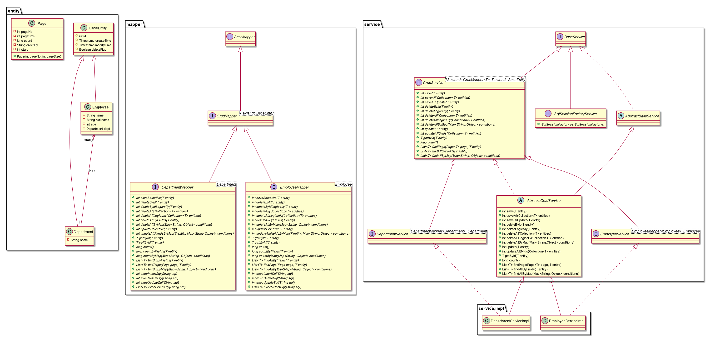
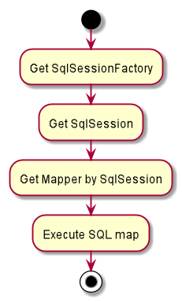
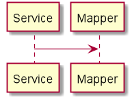

# Software Design Document for mybatis-sql-map-by-annotations

**Content**

- Architecture Design
  - System Architecture
  - Hardware Architecture
  - Software Architecture
  - Information Architecture
  - Internal Communications Architecture
  - Security Architecture
  - Performance
- System Design
  - System User Cases
  - System Modules
  - Database Design
  - System Interface Design
  - User Interface Design
- Detailed Design
  - xxx Module (or xxx Component)
- Appendix I

## Architecture Design

## System Design

### Database Design

t_department

| Name        | Type         | Length | NULL     | Default | Key  | Comment |
| ----------- | ------------ | ------ | -------- | ------- | ---- | ------- |
| id          | INT UNSIGNED |        | not null |         | P    |         |
| name        | VARCHAR      | 64     | not null |         |      |         |
| delete_flag | BOOL         |        | not null | 0       |      |         |
| create_time | TIMESTAMP    |        | not null | NOW()   |      |         |
| modify_time | TIMESTAMP    |        | null     |         |      |         |

t_employee

| Name        | Type         | Length | NULL     | Default | Key  |    Comment    |
| ----------- | ------------ | ------ | -------- | ------- | ---- | :-----------: |
| id          | INT UNSIGNED |        | not null |         | P    |               |
| name        | VARCHAR      | 64     | not null |         |      |               |
| nickname    | VARCHAR      | 64     | null     |         |      |               |
| age         | INT          |        | null     |         |      |               |
| dept_id     | INT          |        | null     |         |      | department id |
| delete_flag | BOOL         |        | not null | 0       |      |               |
| create_time | TIMESTAMP    |        | not null | NOW()   |      |               |
| modify_time | TIMESTAMP    |        | null     |         |      |               |

Database SQL reference: docs/db/database-building.sql

## Detailed Design

> - #Project
> - Project Files Structure
> - Project Implementation Process Description
> - #Design
> - Modules' UML Class Diagrams (how to implement all requirements in object-oriented)
> - Modules' UML Activity Diagram (Implement details)
> - Modules' UML Sequence Diagram (Implement details)
> - #Implementations
> - Modules' Core Function Implementation Algorithm
> - Modules' Requirements Implementations

### Project Files Structure

```
/docs
|----software-requirements-specification.md
|----software-design-document.md
|----project-plans-estimates-schedules.md
|----software-project-building.md
|----/img
|--------class-diagram.txt .png
|--------sequence-diagram.txt .png
|--------activity-diagram.txt .png
|----/db
|--------database-buiding.sql
/src
|----/main/java
|--------/<groupId>/entity
|--------/<groupId>/mapper
|--------/<groupId>/service
|----/main/resources
|------------log4j2.xml
|------------/mybatis/db.properties
|----/test/java
pom.xml
README.md
```

### Project Implementation Process Description

- Building Maven Project
- Generating basic entities, mappers and XML SQL map by the mybatis-generator project.
- Add MyBatis Configurations.
- Add classes hierarchy files.
- Write all service interfaces methods
- Write all service unit tests
- Write all service implementations
- Write all mapper interfaces methods
- Write all mapper unit tests
- Write all mapper annotations
- Finally, Pass all Mapper unit tests
- Update documents

### Class Diagram




### Business Flow Diagram



### Sequence Diagram



### Function Implementation

**FUNC1: Get SqlSessionFactory**

Building SqlSessionFactory without XML

```java
Properties properties = null;
try {
    properties = PropertyUtils.getProperitesByFilePath("mybatis/db.properties");
    dataSource.setUrl(properties.getProperty(String.valueOf(JdbcConfig.MYSQL_URL)));
    dataSource.setUser(properties.getProperty(String.valueOf(JdbcConfig.MYSQL_USER)));
    dataSource.setPassword(properties.getProperty(String.valueOf(JdbcConfig.MYSQL_PASSWD)));
} catch (IOException e) {
    LoggerUtil.loggerError(logger, e);
}


DataSource dataSource = new org.apache.ibatis.datasource.pooled.PooledDataSource(
        dbDriver, databasenameURL, user, password);

TransactionFactory transactionFactory =
  new JdbcTransactionFactory();
Environment environment =
  new Environment("development", transactionFactory, dataSource);
Configuration configuration = new Configuration(environment);
configuration.addMapper(BlogMapper.class);
SqlSessionFactory sqlSessionFactory =
  new SqlSessionFactoryBuilder().build(configuration);
```

### Requirements Implementation

**REQ1: curd**

MyBatis SQL Map by Annoations

@Select

```
@Select("select * from users where id = #{id}")
User getUserById(Integer id);
```

@Select 

```java
final String sql = "${sql}";

@Select(sql)
void execute(HashMap<String, String> m);
```

@Select @Results

```
@Select("select * from user where ${column} = #{value}")
User findByColumn(@Param("column") String column, @Param("value") String value);
@Results(id = "userResult", value = {
  @Result(property = "id", column = "uid", id = true),
  @Result(property = "firstName", column = "first_name"),
  @Result(property = "lastName", column = "last_name")
})
```

@SelectProvider

```
@SelectProvider(type = UserSqlBuilder.class, method = "buildGetUsersByName")
List<User> getUsersByName(@Param("name") String name, @Param("orderByColumn") String orderByColumn);
```

```
public interface SqlMapper {

    static class PureSqlProvider {
        public String sql(String sql) {
            return sql;
        }

        public String count(String from) {
            return "SELECT count(*) FROM " + from;
        }
    }

    @SelectProvider(type = PureSqlProvider.class, method = "sql")
    public List<?> select(String sql);

    @SelectProvider(type = PureSqlProvider.class, method = "count")
    public Integer count(String from);

    @SelectProvider(type = PureSqlProvider.class, method = "sql")
    public Integer execute(String query);
}
```

@InsertProvider

@DeleteProvider

@UpdateProvider

SQL builder 

```
public String selectPersonsWithOffsetLimitSql() {
  // SELECT id, name FROM PERSON
  //     LIMIT #{limit} OFFSET #{offset}
  return new SQL()
    .SELECT("id", "name")
    .FROM("PERSON")
    .LIMIT("#{limit}")
    .OFFSET("#{offset}")
    .toString();
}

public static String getUsersByName(final String name) {
  return new SQL(){{
    SELECT("*");
    FROM("users");
    if (name != null) {
      WHERE("name like #{value} || '%'");
    }
    ORDER_BY("id");
  }}.toString();
}
```

**REQ2: paging**

select page SQL

**REQ3: raw sql**

@Select(${sql})

**REQ4: one-to-one**

one = @One(select = "<mapper_method_name>")

Product ->service

```
@Select("select * from product where id=#{id}")
@Results({
        @Result(property = "id", column = "id"),
        @Result(property = "productStatus", column = "product_status"),
        @Result(property = "createdBy", column = "created_by"),
        @Result(property = "createdDate", column = "created_date"),
        @Result(property = "modifiedBy", column = "modified_by"),
        @Result(property = "modifiedDate", column = "modified_date"),
        @Result(property = "service", column = "service", one = @One(select = "getService")),
})
public Product getProduct(Integer id);

@Select("select * from service where id=#{id}")
@Results({
        @Result(property = "id", column = "id"),
        @Result(property = "serviceStatus", column = "service_status"),
        @Result(property = "name", column = "name"),
        @Result(property = "createdBy", column = "created_by"),
        @Result(property = "createdDate", column = "created_date"),
        @Result(property = "modifiedBy", column = "modified_by"),
        @Result(property = "modifiedDate", column = "modified_date")
})
public Service getService(Integer id);
```

**REQ5: one-to-many**

Product --> Employee

many=@Many(select="<mapper_method_name>")

```
@Results({
	@Result(property = "employees", column = "service", many=@Many(select="<mapper_method_name>")
})
```


**REQ6: batch operations**

batch operations SQL

**REQ7: multiple parameters in mapper**

```
mapperMethod(@Param DataType <variableName>)
```

**REQ8: call stored procedure**

```
@Select("")
@Options(statementTye = StatementType.CALLABLE)
T callById(Integer id
```


## References

[1] [mybatis](https://mybatis.org/mybatis-3/java-api.html)

[2] [Quick Guide to MyBatis](https://www.baeldung.com/mybatis)